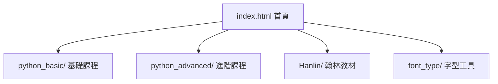

# 🐍 Python Interactive 互動教學專案

<<<<<<< HEAD
[](https://python.org)
[](https://opensource.org/licenses/MIT)

> **一套專為教學設計的 Python 互動網頁集合**  
> 基於純 HTML5, Tailwind CSS 與 Vanilla JavaScript 實作，無需安裝任何環境或伺服器，直接在瀏覽器中即可體驗 Python 語法邏輯。

---

## 🌟 核心特色

- **零環境建置**：下載即用，適合電腦教室、平板或離線環境。
- **即時模擬執行**：由 JavaScript 精準模擬 Python Console 輸出，反應迅速。
- **視覺化教學**：結合逐行程式碼高亮與動態邏輯圖解（如數線圖、流程圖）。
- **響應式設計**：支援跨裝置瀏覽，確保在各類螢幕上皆有良好的閱讀體驗。

---

## 📁 專案架構



- **`index.html`**：專案入口，提供直觀的導覽介面。
- **`python_basic/`**：初學者導向，涵蓋變數、判斷式與基本迴圈。
- **`python_advanced/`**：進階專題，探討串列生成式、格式化輸出及複雜邏輯。
- **`Hanlin/`**：專門對應翰林版高中資訊科技教材的練習模組。
- **`font_type/`**：協助初學者辨識全半形與易混淆字元的工具。

---

## 🗂️ 模組詳細說明

### 🎓 翰林教材版 (`Hanlin/`)
*   **目標檔案**：`114HanLin_final.html`
*   **對應章節**：2-2 變數、運算、判斷與迴圈。
*   **特殊設計**：
    *   **Tab 化介面**：依主題切換練習。
    *   **教學鎖定**：禁用右鍵與文字複製，引導學生自行思考輸入。
    *   **終端機模擬**：高品質的 Console 介面與 `\n` 換行示範。

### 🐍 Python 基礎課程 (`python_basic/`)
*   **目標檔案**：`python_basic_final.html`
*   **特色**：14 個核心章節，包含運算思維、輸入輸出與除錯擂台。

### 🚀 Python 進階課程 (`python_advanced/`)
*   **目標檔案**：`python_advanced_final.html`
*   **特色**：深入探討 Python 3.10+ 新特性（如 `match-case`）與進階資料處理。

---

## 🚀 快速上手

### 本機開啟
直接點擊 `index.html` 即可進入導覽頁。

### 開發者模式
若需進行二次開發或避免某些瀏覽器的安全性限制，建議使用本地伺服器：
```bash
python -m http.server 8000
```

---

## 🛠️ 技術棧

- **Styling**: [Tailwind CSS](https://tailwindcss.com/)
- **Logic**: Vanilla JavaScript (ES6+)
- **Icons**: [Lucide](https://lucide.dev/)
- **Visualization**: SVG & CSS Animations

---

## 📌 聲明與貢獻
本專案為教學輔助用途，旨在提升程式設計學習者的興趣與直觀理解。歡迎各界教師與開發者共同完善內容。

&copy; 2026 Python Interactive Project.
=======
> 一套以純 HTML + JavaScript 實作的 Python 互動式教學網頁集合，
> 無需安裝任何環境，直接在瀏覽器中開啟即可使用。

---

## 📁 專案結構

```
python_Interactive-main/
│
├── index.html                            # 專案入口首頁（導覽頁）
│
├── python_basic/
│   └── python_basic_final.html           # Python 基礎互動課程
│
├── python_advanced/
│   └── python_advanced_final.html        # Python 進階互動課程
│
├── Hanlin/
│   ├── 114HanLin_final_v2_20260110.html  # 翰林教材對應互動網頁
│   └── 114HanLin_webpage_spec.txt        # 翰林版功能規格說明書
│
└── font_type/
    └── font_type_final.html              # 字型與全形/半形輸入說明
```

---

## 🗂️ 各模組說明

### 1. Python 基礎課程 (`python_basic/`)

**定位：** Python 初學者入門，涵蓋核心語法概念，搭配逐行動畫說明。

**技術特色：**
- Tailwind CSS 排版，響應式設計
- 逐行程式碼高亮動畫（純 CSS/JS，無需外部執行器）
- lucide 圖示庫

**課程章節：**

| # | 章節名稱 |
|---|----------|
| 1 | 運算思維：解題的四個神隊友 |
| 2 | 顏色小字典：編輯器的「色彩密碼」 |
| 3 | 變數命名規則 (Naming Rules) |
| 4 | 變數 vs 函式：資料盒與工具箱 |
| 5 | 輸入 (Input) 與資料型態 |
| 6 | 輸出格式 (Output) |
| 7 | 資料型態與運算 |
| 8 | 條件判斷 (If Statements) |
| 9 | 串列與 For 迴圈 (Lists & Loops) |
| 10 | While 迴圈實驗室 |
| 11 | 字串處理工具箱 (String Methods) |
| 12 | 自訂函式 (Functions) |
| 13 | 除錯擂台 (Common Errors & Debugging) |
| 14 | 常見內建函式 (Built-in Functions) |

---

### 2. Python 進階課程 (`python_advanced/`)

**定位：** 已有基礎的學習者，深入學習進階語法與觀念。

**技術特色：**
- Tailwind CSS 排版
- 27 個以上互動示範 Demo（點擊觸發、即時輸出）
- 無需 Python 環境，由 JavaScript 模擬執行結果

**課程章節：**

| 大章 | 主題 | 子章節 |
|------|------|--------|
| 1 | 輸入輸出進階 | 同行輸入 (split & map)、同行輸出 (end & sep)、格式化輸出 (f-string) |
| 2 | 運算子進階 | 複合指派運算子、三元運算子、位元運算子、短路求值 |
| 3 | 條件判斷進階 | `in` 多值檢查、巢狀條件簡化、真值測試 (Truthy/Falsy)、match-case (3.10+) |
| 4 | 迴圈進階 | enumerate & zip、串列生成式 & reversed、for-else 子句 |
| 5 | While 進階 | 旗標 (Flag) 模式、模擬 do-while、迴圈不變式 |
| 6 | 串列進階 | 切片進階、淺拷貝 vs 深拷貝、多維串列 (矩陣)、sort vs sorted、串列解包 |
| 7 | 字串進階 | 格式化對齊/填充/千分位、正則表達式基礎、Unicode/UTF-8 編碼、join 效能、多行字串 |

---

### 3. 翰林教材版 (`Hanlin/`)

**定位：** 對應翰林出版社高中「2-2 變數、運算、判斷與迴圈」章節，適合課堂搭配使用。

**技術特色：**
- 頂部 5 個 Tab 切換介面
- 模擬 Python Console 輸出（綠色背景終端機樣式）
- 右側動態程式碼展示（隨輸入即時更新）
- 防止右鍵 / 文字複製（教學用反作弊設計）
- 有無 `\n` 換行符號切換示範

**課程 Tab：**

| Tab | 主題 | 核心概念 |
|-----|------|----------|
| 1 | 哈囉 (Greeting) | `input()`, `print()`, 字串型態 |
| 2 | 求平均數 | `int()`, `float`, 算術運算 |
| 3 | 計算學期成績 / 個人成績比較 | `if/else`, `if/elif/else` |
| 4 | 累加計算 | `for` 迴圈, `range()` |
| 5 | 密碼檢查 | `while` 迴圈, 複合條件, 計數器 |

---

### 4. 字型樣式測試 (`font_type/`)

**定位：** 輔助工具，協助學生辨識程式撰寫時常見的輸入問題。

**內容：**
- 英文大小寫（Case Sensitivity）視覺對比
- 全形字元 vs 半形字元（Width Comparison）對照
- 鍵盤輸入法切換指南（避免全形符號造成語法錯誤）

---

## 🚀 使用方式

所有網頁皆為**純靜態 HTML**，不需伺服器或安裝套件。

### 方法一：直接開啟（本機）

```
雙擊 index.html → 選擇要使用的模組
```

### 方法二：架設本地伺服器（推薦，避免瀏覽器限制）

```bash
# 在專案根目錄執行
python -m http.server 8000
```

然後開啟瀏覽器前往：`http://localhost:8000`

---

## 🛠️ 技術架構

| 技術 | 用途 |
|------|------|
| HTML5 | 頁面結構 |
| Tailwind CSS (CDN) | 樣式排版 |
| Vanilla JavaScript | 互動邏輯、模擬 Python 執行 |
| lucide (CDN) | 圖示 |

> 所有互動功能由 JavaScript 模擬 Python 執行結果，**不依賴任何 Python 直譯器**（無 Skulpt / Pyodide）。

---

## 📌 注意事項

- 翰林版網頁有**禁用右鍵與文字選取**的設計，為教學用途，`input` / `textarea` 欄位不受影響。
- 各 HTML 檔案體積約 57KB ～ 135KB，所有邏輯內嵌於單一檔案中，方便分享與離線使用。
- 進階課程的互動 Demo 以 JavaScript 模擬輸出，行為與真實 Python 一致，但不支援任意程式碼輸入執行。
>>>>>>> 7c4c3b8885b5e188aab7d13f702b35343e2bdb66
